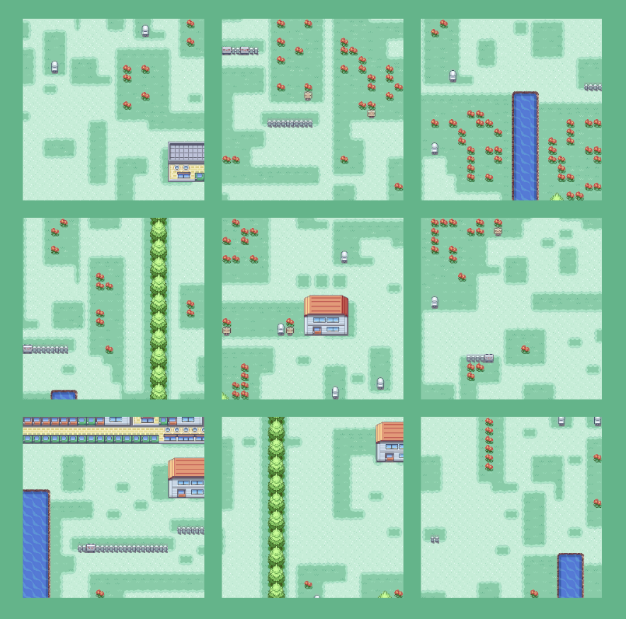

# Infinimon

Improving Reliability and Consistency of the [Wave Function Collapse](https://github.com/mxgmn/WaveFunctionCollapse) algorithm.

.

## Description

This repository contains multiple tools to explore the kinds of levels WFC can generate from a given tilemap. It is currently a proof of concept, so the usability is not a top priority.

The pipeline we offer is the following:

1. Analyse a tilemap into a tileset and adjacency rules.
2. Use the *InfinimonCLI* to generate an archive of input to Wave Function Collapse.
3. Use the *Archive Explorer* to explore the archive of input to WFC showing different levels belonging to a specific part of the behavior space.

We believe this pipeline can be of help to game developers in *mixed-initiative PCG*, where the designers works and the algorithm works in collaboration to create content.

For a more detailed explanation of this project, read [our thesis report](Docs/oljh_wihe_MastersThesis.pdf).

### The InfinimonCLI tool

A command line interface program that can create an archive of weights for WFC. The command line program can be run either from the binary or built from the project in the folder ``DotNet/CLI``.

#### Command Line Switches Reference

The CLI supports a number of command line switches. The deafult Run Mode is Constrained MAP-Elites (no switch).

| Long Switch        | Short Switch | Category      | Notes                                                                                                  |
| :----------------- | :----------- | :------------ | :----------------------------------------------------------------------------------------------------- |
| `--skip-stats`     | `-s`         | Statistics    | Disables statistics generation.                                                                        |
| `--regular`        | `-r`         | Run Mode      | Standard MAP-Elites run mode.                                                                          |
| `--hyper`          | `-h`         | Run Mode      | Used for hyperparameter tuning.                                                                        |
| `--iterations`     | `-i`         | Run Mode      | Runs comparisons evaluation iteration.                                                                 |
| `--domain=[int]`   | `-d=[int]`   | Configuration | Sets the problem domain. 0 = Letter, 1 = Arrow, 2 = Pokémon (default)                                  |
| `--mutation=[int]` | `-m=[int]`   | Configuration | Sets the mutation strategy. 0 = All Tiles (default), 1 = 1/3 Tiles, 2 = Special Tile Only, 3 = CMA-CME |
| `--entropy`        | `-e`         | Behavior      | Changes variation behavior to entropy-based calculation.                                               |

### The Archive Explorer

The Archive Explorer can be launched from the Unity build or from the Unity project itself. You can also explore it [from the browser](https://william227.itch.io/archive-explorer-masters-thesis). From here, 3 pre-packaged archives can be browsed, one for each domain, taken from the 'Domain Difficulty' experiments from our report.

It is also possible to browse a custom archive by picking the 'Custom' option from the domain dropdown. The archives from the ``Results`` folder in the root directory are a good starting point.

The top-left buttons pick which cell in the archive is sampled from.

The user can specify the speed of which the samples are generated. This visualizes the process of the Wave Function Collapse Algorithm.

## Prerequisites

InfinimonCLI requires:

* [.Net 10 runtime (and .Net 10 SDK for builds)](https://dotnet.microsoft.com/en-us/download/dotnet/10.0).
* Optional (only required for statistics): [Python 3](https://www.python.org/downloads/) (we used 3.13), with the packages [matplotlib](https://pypi.org/project/matplotlib/) and [numpy](https://pypi.org/project/numpy/).

Archive Explorer:

* Requires system compatible with [Unity 6.3 player requirements](https://docs.unity3d.com/6000.3/Documentation/Manual/system-requirements.html).

Unity Project:

* Requires Unity version 6.3.9f1 or compatible version.

## Why and when?

This project is the Master's Thesis of [Oliver Juhl Friis Hansen](https://olifrys.dk) and [Willaim Skou Heidemann](https://www.linkedin.com/in/william-skou-heidemann-8b7b4019b/) for their MSc in Games Technology from the IT-University of Copenhagen in 2026.
